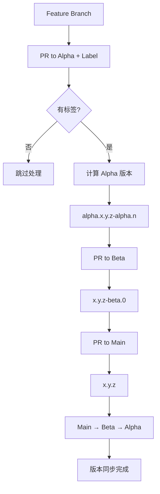

# 版本管理 GitHub Action

[](https://github.com/yuxu-palace/version-patch-action/releases)
[](https://github.com/yuxu-palace/version-patch-action/blob/main/LICENSE)

一个专门为语义化版本管理和自动化发布设计的 GitHub Action。支持 Alpha/Beta/Main 三级分支管理策略，提供智能版本推导、CHANGELOG 生成、npm 包发布等功能。

## 🌟 核心特性

- **🔄 三级分支管理**：支持 alpha → beta → main 分支策略
- **🏷️ 智能版本推导**：基于 PR 标签和分支关系自动计算版本
- **📦 npm 包发布**：支持自动发布到 npm registry，含标签管理
- **📝 CHANGELOG 生成**：基于 conventional commits 自动生成变更日志
- **🔗 分支同步**：自动同步版本到下游分支，智能冲突解决
- **💬 PR 评论**：实时预览版本变更，提供详细的版本信息

## 📋 版本管理规则

### Alpha 分支 (`alpha`)
- **触发条件**：PR 必须包含标签 (`major`, `minor`, `patch`)，无标签则跳过
- **版本计算规则**：
  1. 基于标签类型推导目标基础版本号（从 main 分支版本 + 标签）
  2. 比较推导版本与当前 alpha 版本：
     - **高于当前版本**：修改基础号，重置测试号（`x.y.z-alpha.0`）
     - **低于等于当前版本**：只增加测试号计数（`x.y.z-alpha.n++`）

```
示例：
Main: v1.0.0, Alpha: v1.1.0-alpha.2
PR 标签: minor → 目标: v1.1.0 ≤ v1.1.0 → 结果: v1.1.0-alpha.3

Main: v1.0.0, Alpha: v1.1.0-alpha.2  
PR 标签: major → 目标: v2.0.0 > v1.1.0 → 结果: v2.0.0-alpha.0
```

### Beta 分支 (`beta`)
- **源分支判断**：
  - **来自 Alpha**：取 alpha 基础号，重置测试号（`x.y.z-beta.0`）
  - **来自其他分支**：仅允许 bug 修复，递增测试号（需要现有 beta 版本）

- **业务规则**：
  - 全新功能必须先经过 Alpha 测试，不允许直接合并到 Beta
  - 只有当前存在对应基础号的 Beta 版本时，才允许非 Alpha 分支的合并

### Main 分支 (`main`)
- **严格限制**：只接受来自 Beta 分支的合并
- **版本转换**：去除预发布标识，发布正式版本（`x.y.z-beta.n` → `x.y.z`）

### 分支同步策略
- **Main → Beta**：使用 `rebase` 同步
- **Beta → Alpha**：使用 `merge` 同步
- **智能冲突处理**：自动创建 Issue 记录无法解决的冲突

## 🚀 快速开始

### 1. 基本配置

在您的项目中创建 `.github/workflows/version-management.yml`：

```yaml
name: 版本管理

on:
  pull_request:
    branches: [main, beta, alpha]
    types: [opened, synchronize, reopened, labeled, unlabeled, closed]

jobs:
  version-management:
    runs-on: ubuntu-latest
    permissions:
      contents: write
      issues: write
      pull-requests: write

    steps:
      - name: Checkout
        uses: actions/checkout@v4
        with:
          fetch-depth: 0

      - name: 版本管理
        uses: yuxu-palace/version-patch-action@main
        with:
          token: ${{ secrets.GITHUB_TOKEN }}
          
          # 版本管理配置
          version-prefix: 'v'
          supported-branches: 'main,beta,alpha'
          enable-changelog: 'true'
          
          # npm 发布配置
          enable-npm-publish: 'true'
          npm-token: ${{ secrets.NPM_TOKEN }}
          npm-registry: 'https://registry.npmjs.org/'
          npm-access: 'public'
```

### 2. NPM 发布配置

如需启用 npm 自动发布，需要：

1. **配置 NPM_TOKEN**：在仓库 Settings → Secrets 中添加 `NPM_TOKEN`
2. **设置发布参数**：

```yaml
- name: 版本管理
  uses: yuxu-palace/version-patch-action@main
  with:
    # ... 基础配置
    
    # NPM 发布配置
    enable-npm-publish: 'true'          # 启用 npm 发布
    npm-token: ${{ secrets.NPM_TOKEN }} # NPM 认证令牌
    npm-registry: 'https://registry.npmjs.org/'  # NPM 仓库地址
    npm-tag: 'latest'                   # 发布标签 (latest/beta/alpha/自定义)
    npm-access: 'public'                # 包访问权限 (public/restricted)
    npm-publish-strict: 'false'         # 严格模式 (发布失败是否中断流程)
```

### 3. PR 标签配置

在您的仓库中创建以下标签：

- `major`：主版本更新（破坏性变更）
- `minor`：次版本更新（新增功能）  
- `patch`：补丁版本更新（bug 修复）

### 4. package.json 配置要求

如果启用 npm 发布功能，请确保您的 `package.json` 包含以下配置：

```json
{
  "name": "@your-scope/your-package-name",
  "version": "1.0.0",
  "description": "Your package description",
  "main": "dist/index.js",
  "types": "dist/index.d.ts",
  "files": [
    "dist",
    "README.md",
    "LICENSE"
  ],
  "scripts": {
    "build": "your-build-command",
    "test": "your-test-command"
  },
  "keywords": ["keyword1", "keyword2"],
  "author": "Your Name <your.email@example.com>",
  "license": "MIT",
  "repository": {
    "type": "git",
    "url": "git+https://github.com/your-org/your-repo.git"
  },
  "homepage": "https://github.com/your-org/your-repo#readme",
  "publishConfig": {
    "access": "public"
  }
}
```

**重要字段说明**：
- `name`: 包名，建议使用 scoped name (@scope/package)
- `version`: 版本号（Action 会自动更新此字段）
- `main`: 包的入口文件
- `files`: 发布时包含的文件/目录
- `publishConfig.access`: 发布权限（public/restricted）

## 📖 使用示例

### Alpha 分支开发流程

```bash
# 1. 创建功能分支
git checkout -b feature/new-api alpha
# ... 开发新功能

# 2. 创建 PR 到 alpha 分支，添加 minor 标签
# Action 将自动：
# - 计算新版本：v1.2.0-alpha.0
# - 更新 package.json 和 CHANGELOG
# - 创建版本标签

# 3. 继续迭代
# 后续 PR 如果标签相同，将递增测试号：v1.2.0-alpha.1
```

### Beta 分支测试流程

```bash
# 1. Alpha 功能完成，创建 PR：alpha → beta
# Action 将自动：
# - 创建 Beta 版本：v1.2.0-beta.0
# - 同步代码到 alpha 分支

# 2. 发现 bug，创建修复分支
git checkout -b hotfix/beta-bug beta
# ... 修复 bug

# 3. 创建 PR：hotfix/beta-bug → beta
# Action 将递增测试号：v1.2.0-beta.1
```

### Main 分支发布流程

```bash
# Beta 测试完成，创建 PR：beta → main
# Action 将自动：
# - 发布正式版本：v1.2.0
# - 发布到 npm (如果启用)
# - 同步代码到 beta 和 alpha 分支
```

## 💬 PR 评论输出

Action 会在 PR 中自动创建评论，显示版本管理信息：

### 版本预览评论
当 PR 有版本标签时，会显示版本预览：

```markdown
## 📦 版本管理

| 项目 | 值 |
|------|-----|
| **源分支** | `feature/new-api` |
| **目标分支** | `alpha` |
| **当前版本** | `v1.0.0-alpha.1` |
| **下一版本** | `v1.1.0-alpha.0` |

> ℹ️ 这是预览模式，合并 PR 后将自动创建 tag 并更新版本。
```

### 跳过处理评论
当 PR 无需版本升级时：

```markdown
## 📦 版本管理

| 项目 | 值 |
|------|-----|
| **目标分支** | `alpha` |
| **当前版本** | `v1.0.0-alpha.1` |
| **状态** | `跳过 - 无需升级` |

> ℹ️ 根据当前分支状态和标签，无需进行版本升级。
```

### 错误评论
当遇到错误时：

```markdown
## 📦 版本管理

❌ **错误信息**

Alpha分支只能在正式版本或Alpha版本后继续开发，当前最新版本: v1.0.0-beta.1 (beta)

> 请确保在创建新功能之前，所有已有功能都已完成完整的发布流程（alpha → beta → main）。
```

**注意**：当前 PR 评论不包含 npm 发布状态信息，npm 发布结果可以通过 Action 的输出参数获取。

## ⚙️ 配置参数

### 基础配置

| 参数 | 描述 | 必需 | 默认值 |
|------|------|------|--------|
| `token` | GitHub token | ✅ | - |
| `version-prefix` | 版本标签前缀 | ❌ | `v` |
| `git-user-name` | Git 提交用户名 | ❌ | `GitHub Action` |
| `git-user-email` | Git 提交邮箱 | ❌ | `action@github.com` |
| `supported-branches` | 支持的分支列表 | ❌ | `main,beta,alpha` |
| `enable-changelog` | 启用 CHANGELOG 生成 | ❌ | `true` |
| `comment-title` | PR 评论标题 | ❌ | `📦 版本管理` |

### NPM 发布配置

| 参数 | 描述 | 必需 | 默认值 |
|------|------|------|--------|
| `enable-npm-publish` | 启用 npm 发布 | ❌ | `false` |
| `npm-token` | NPM 认证令牌 | ❌ | - |
| `npm-registry` | NPM 仓库地址 | ❌ | `https://registry.npmjs.org/` |
| `npm-tag` | 发布标签 | ❌ | `latest` |
| `npm-access` | 包访问权限 | ❌ | `public` |
| `npm-publish-strict` | 严格模式 | ❌ | `false` |

### 输出参数

| 输出 | 描述 |
|------|------|
| `next-version` | 计算出的新版本号 |
| `preview-version` | 预览版本号 |
| `is-preview` | 是否为预览模式 |
| `published-version` | NPM 发布的版本号 |
| `published-tag` | NPM 发布标签 |
| `npm-publish-failed` | NPM 发布是否失败 |

## 🔧 高级配置

### 私有 NPM 仓库

```yaml
npm-registry: 'https://npm.your-company.com/'
npm-access: 'restricted'
```

### 自定义版本前缀

```yaml
version-prefix: 'rel-'  # 生成标签：rel-1.0.0
```

### 多分支支持

```yaml
supported-branches: 'main,beta,alpha,staging'
```

## 📚 工作流程图



## 🤝 分支策略最佳实践

### 开发流程建议

1. **功能开发**：在 alpha 分支进行新功能开发
2. **集成测试**：功能稳定后合并到 beta 进行集成测试
3. **生产发布**：测试完成后合并到 main 发布生产版本
4. **热修复**：在对应环境分支创建修复分支

### 标签使用建议

- `major`：API 破坏性变更、架构重构
- `minor`：新增功能、新增 API
- `patch`：bug 修复、性能优化、文档更新

## 📝 故障排除

### 常见问题

1. **版本计算错误**
   - 检查分支标签是否正确
   - 确认 PR 来源和目标分支符合规则

2. **NPM 发布失败**
   - 验证 NPM_TOKEN 是否有效且有发布权限
   - 检查包名是否已存在且有权限发布
   - 确认 package.json 中的 `name` 字段正确
   - 查看 `npm-publish-error` 输出参数获取详细错误信息
   - 检查 `publishConfig.access` 设置是否正确

3. **分支同步冲突**
   - Action 会自动创建 Issue 记录冲突
   - 手动解决冲突后重新运行

4. **package.json 配置问题**
   - 确保 `files` 字段包含了需要发布的文件
   - 检查 `main` 和 `types` 字段路径是否正确
   - 验证构建产物是否存在于指定路径

### NPM 发布权限设置

1. **公开包发布**：
   ```bash
   npm login
   npm whoami  # 确认登录状态
   ```

2. **组织包发布**：
   ```bash
   # 确保您是组织成员且有发布权限
   npm org ls your-org-name
   ```

3. **获取发布 Token**：
   ```bash
   npm token create --read-only=false --cidr-whitelist=""
   ```

### 调试技巧

启用详细日志：

```yaml
- name: 版本管理
  uses: yuxu-palace/version-patch-action@main
  with:
    # ... 配置参数
  env:
    ACTIONS_STEP_DEBUG: true
```

## 🏗️ 本地开发

### 环境要求

- Node.js 20+
- pnpm 10+

### 安装依赖

```bash
pnpm install
```

### 构建

```bash
pnpm build
```

### 代码格式化

```bash
pnpm check
pnpm format
```

## 📄 许可证

MIT License - 详见 [LICENSE](LICENSE) 文件。

## 🤝 贡献

欢迎提交 Issue 和 Pull Request！请确保：

1. 遵循现有代码风格
2. 添加适当的测试
3. 更新相关文档

---

如有问题，请在 [Issues](https://github.com/yuxu-palace/version-patch-action/issues) 中反馈。